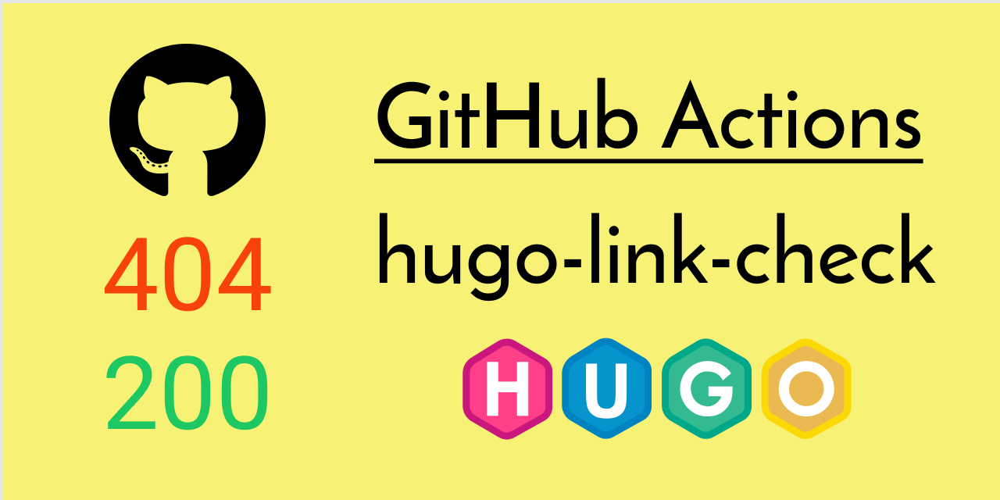

[](https://github.com/peaceiris/actions-hugo-link-check/blob/master/LICENSE)
[](https://github.com/peaceiris/actions-hugo-link-check/releases/latest)
[](https://github.com/peaceiris/actions-hugo-link-check/releases)


## GitHub Actions for hugo-link-check

- [raviqqe/muffet: Fast website link checker in Go](https://github.com/raviqqe/muffet)




## Getting started

### Create `main.workflow`

```sh
workflow "Main workflow" {
  on = "push"
  resolves = ["hugo-link-check"]
}

action "is-branch-master" {
  uses = "actions/bin/filter@master"
  args = "branch master"
}

action "hugo-link-check" {
  needs = "is-branch-master"
  uses = "peaceiris/actions-hugo-link-check@v0.55.5"
  env = {
    OPTIONS = ""
  }
}
```


## License

[MIT License - peaceiris/actions-hugo-link-check]

[MIT License - peaceiris/actions-hugo-link-check]: https://github.com/peaceiris/actions-hugo-link-check/blob/master/LICENSE


## Supprt author

<a href="https://www.patreon.com/peaceiris"></a>
